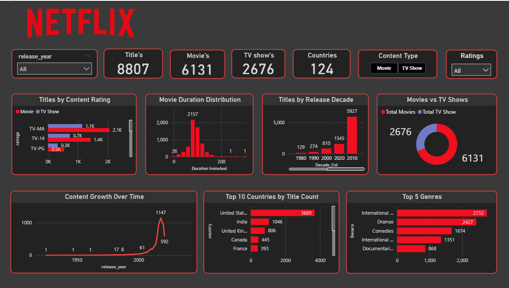

# 🎬 Netflix Power BI Dashboard

## 📊 Project Overview

This project is an interactive Netflix content analysis dashboard developed using **Microsoft Power BI**.

The dashboard provides insights into Netflix movies and TV shows based on content type, ratings, genres, countries, release years, and content growth over time.

## 🎯 Project Objectives

* Analyze Movies vs TV Shows.
* Analyze Netflix content by country.
* Identify the most popular genres.
* Analyze content ratings.
* Study content growth over time.
* Analyze movie duration.
* Compare content across different release decades.
* Create an interactive business intelligence dashboard.

## 🛠️ Tools & Technologies

* Microsoft Power BI
* Power Query
* DAX
* Data Cleaning
* Data Transformation
* Data Visualization

---

## 📈 Dashboard Features

### KPI Cards

* Total Titles: 8,807
* Total Movies: 6,131
* Total TV Shows: 2,676
* Total Countries: 124

### Visualizations

* Titles by Content Rating
* Movie Duration Distribution
* Titles by Release Decade
* Movies vs TV Shows
* Content Growth Over Time
* Top 10 Countries by Title Count
* Top 5 Genres

### Filters

* Release Year
* Content Type
* Rating

---

## 📸 Dashboard Preview

---

## 💡 Key Insights

* Movies represent the larger portion of the Netflix content library.
* The dashboard contains 8,807 titles across 124 countries.
* The United States has the highest number of titles in the country analysis.
* International Movies/TV content and dramas are among the major genre categories.
* Content growth increased significantly in recent years.
* The dashboard allows users to interactively analyze content using release year, content type, and rating filters.

---

## 🚀 Skills Demonstrated

* Data Cleaning
* Power Query
* DAX
* Data Modeling
* KPI Development
* Data Visualization
* Dashboard Design
* Business Intelligence

---

## 👨‍💻 Author

**Swapnil Ghole**

Data Analyst | Power BI | SQL | Python | Advanced Excel
